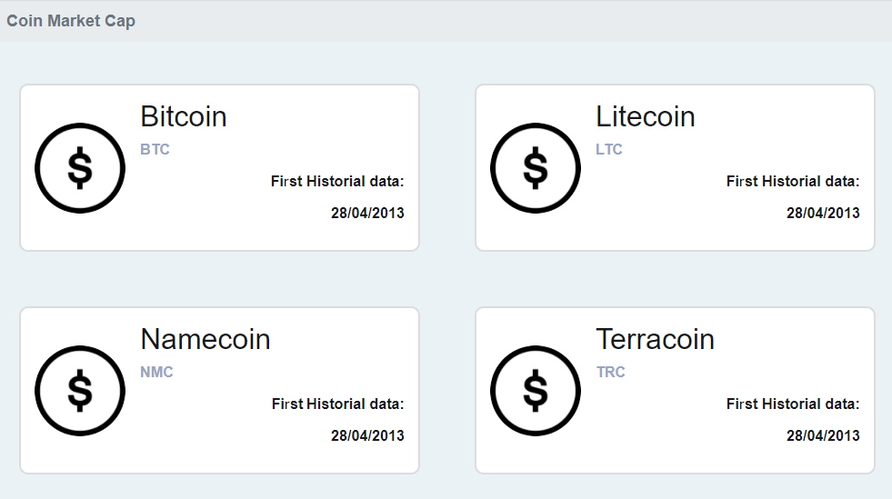

# Fetch API Study

This project is part from the course "request data from an api" from [Digital Innovation One](https://web.digitalinnovation.one/) using Javascript´s "Fetch" to request data.

    

---

# Guide

- [Features](#features)
- [Installation](#installation)
- [Using](#using)
- [Technologies](#technologies)
- [Future Implementations](#future-implementations)

# Features

- Responsive site.
- Uses HTML5, CSS3 and Javascript

# Installation

`git clone https://github.com/cledman/fetch-api-coin`

You have to put your api code (from [Coin Market Cap](https://coinmarketcap.com/api/documentation/v1/)) on the js/script.js
Use the [Moesif extension](https://chrome.google.com/webstore/detail/moesif-origin-cors-change/digfbfaphojjndkpccljibejjbppifbc) for Chrome and enable it.

# Using

`Run the index.html file`

# Technologies

- [HTML](https://www.w3schools.com/html/) to write the page,
- [CSS](https://www.w3schools.com/css/) to handle the styles, layout and rendering,
- [Bootstrap](https://getbootstrap.com/) to handle styles too.

# Future Implementations

- We could have more elements.
- Better work on UX.

Thanks to:

- [Bárbara Casac](https://www.linkedin.com/in/barbaracasac/)

##